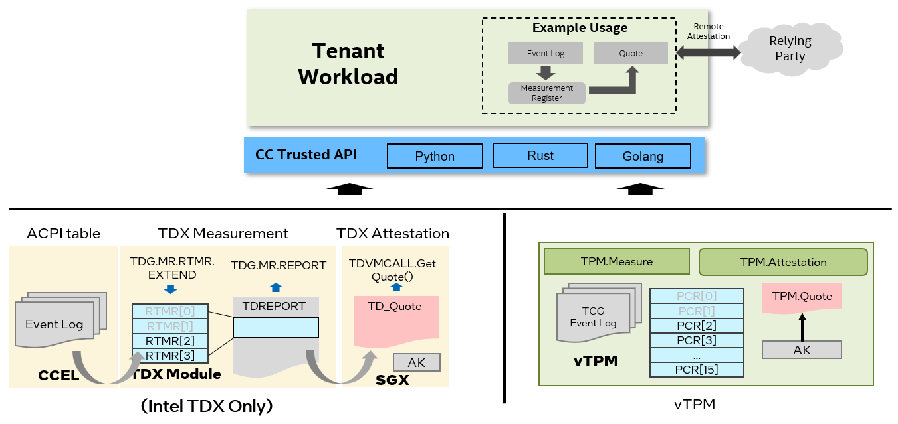

# CC Trusted API

CC Trusted API helps the diverse applications to access and process the trust states
which was represented by integrity measurement, event record, report/quote in the confidential
computing environment.

## TCB Measurement

The diverse application in confidential computing could be firmware or monolithic application
in Confidential VM(CVM), micro service or macro service on Kubernetes. Although
different type application might get the trust states measured in different Trusted
Computing Base (TCB), but the definition and structure of integrity measurement,
event record follows [TCG PC Client Platform Firmware Profile Specification](https://trustedcomputinggroup.org/wp-content/uploads/TCG_PCClient_PFP_r1p05_v23_pub.pdf)

| TCB | Measured By | Specification |
| --- | -------- | ------------- |
| TEE | Vendor Secure Module like Intel TDX module, SEV secure processor | Vendor Specification like [Intel TDX Module Specification](https://cdrdv2-public.intel.com/733575/intel-tdx-module-1.5-base-spec-348549002.pdf) |
| Firmware | [EFI_CC_MEASUREMENT_PROTOCOL](https://github.com/tianocore/edk2/blob/master/MdePkg/Include/Protocol/CcMeasurement.h) | [UEFI Specification 2.10](https://uefi.org/specs/UEFI/2.10/) |
| Boot Loader | [EFI_CC_MEASUREMENT_PROTOCOL](https://github.com/tianocore/edk2/blob/master/MdePkg/Include/Protocol/CcMeasurement.h) | Grub2/Shim |
| OS | Integrity Measurement Architecture (IMA) | [Specification](https://sourceforge.net/p/linux-ima/wiki/Home/) |
| Cloud Native | Confidential Cloud Native Primitives (CCNP) | [Repository](https://github.com/intel/confidential-cloud-native-primitives) |

## Trusted Foundation

Normally Trusted Platform Module(TPM) provides root of trust for PC client platform.
In confidential computing environment, vTPM (virtual TPM) might be provided different
vendor or CSP, which root of trust should be hardened by vendor secure module. Some
vendor also provided simplified solution:

|    | Intel | vTPM |
| --- | --- | --- |
| Integrity Measurement Register | RTMR/MRTD | PCR |
| Event Log ACPI table | CCEL | TPM2 |

## SDKs

The back-end SDK or service will produce the TCB measurements:

| SDK | Deployment Scenarios |
| --- | --------------- |
| Firmware SDK | Firmware Application |
| [VM SDK](https://github.com/cc-api/cc-trusted-api/tree/main/vmsdk) | Confidential Virtual Machine |
| [Confidential Cloud Native Primitives (CCNP)](https://github.com/intel/confidential-cloud-native-primitives) | Confidential Cluster/Container |
